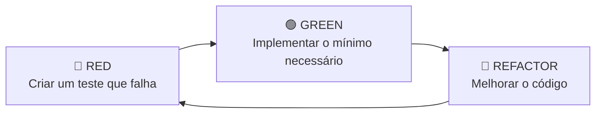
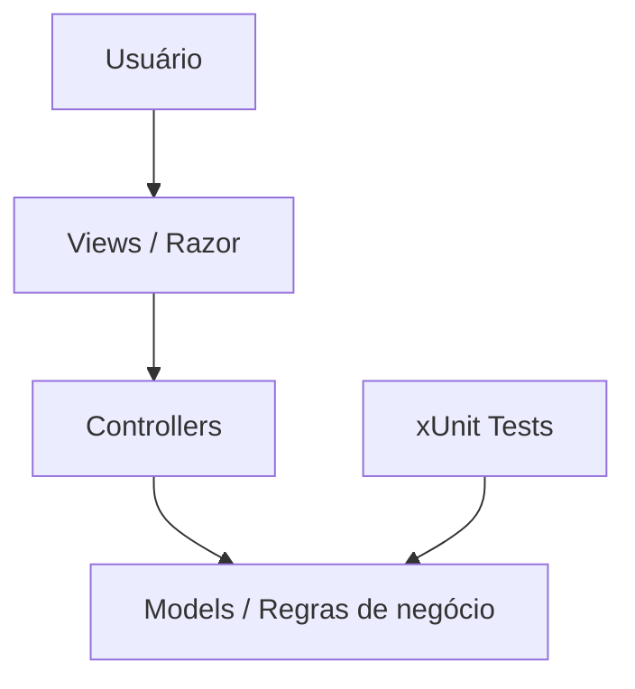

<div align="center">

# 🛒 MerceariaMVC

### Projeto ASP.NET Core MVC desenvolvido com foco em TDD e testes automatizados


**Validação de regras de negócio de clientes e produtos utilizando testes unitários, xUnit e o padrão Arrange → Act → Assert.**

</div>

---

## 📌 Sobre o projeto

O **MerceariaMVC** é um projeto de estudo construído em **ASP.NET Core MVC (.NET 8)** para praticar **TDD — Test-Driven Development** e testes unitários.

O projeto possui uma aplicação MVC e um projeto de testes separado. As regras de negócio são concentradas principalmente nos modelos `Cliente` e `Produto`, enquanto o projeto `MerceariaMVCTests` verifica os diferentes cenários de validação.

### Principais objetivos

- Praticar o ciclo **Red → Green → Refactor** do TDD;
- Separar aplicação e testes em projetos distintos;
- Criar testes unitários com **xUnit**;
- Validar regras de negócio antes de evoluir novas funcionalidades;
- Utilizar o padrão **AAA — Arrange, Act, Assert**;
- Preparar o repositório para integração contínua no GitHub.

---

## 🧪 TDD no projeto

O TDD propõe que os testes orientem o desenvolvimento do código.



### 1. 🔴 Red

Primeiro é definido o comportamento esperado por meio de um teste. Nesse momento, o teste pode falhar porque a regra ainda não foi implementada.

### 2. 🟢 Green

A implementação recebe apenas o código necessário para fazer o teste passar.

### 3. 🔵 Refactor

Com os testes protegendo o comportamento esperado, o código pode ser reorganizado e melhorado com mais segurança.

---

## ✅ Regras de negócio testadas

### 👤 Cliente

A classe `Cliente` possui validações relacionadas aos dados cadastrais e à permissão para realizar compras.

| Regra | Comportamento esperado |
|---|---|
| Idade não informada | Cliente inválido |
| Idade menor que 18 anos | Cliente inválido |
| E-mail sem `@` | Cliente inválido |
| Nome vazio | Cliente inválido |
| Cliente inativo | Não pode comprar |
| Cliente ativo e maior de idade | Pode comprar |
| Nome, idade e e-mail válidos | Cliente válido |

Métodos envolvidos:

```csharp
cliente.ValidacaoCliente();
cliente.PodeComprar();
```

### 📦 Produto

A classe `Produto` valida as informações essenciais antes de considerar um produto válido.

| Regra | Comportamento esperado |
|---|---|
| Preço igual ou menor que zero | Produto inválido |
| Estoque igual ou menor que zero | Produto inválido |
| Nome vazio | Produto inválido |
| Nome, preço e estoque válidos | Produto válido |

Método envolvido:

```csharp
produto.Validacao();
```

---

## 🧱 Arquitetura



A solução é dividida em dois projetos:

- **MerceariaMVC** — aplicação ASP.NET Core MVC;
- **MerceariaMVCTests** — testes unitários da aplicação.

---

## 📂 Estrutura do projeto

```text
MerceariaMVC/
│
├── .github/
│   └── workflows/
│       └── dotnet-tests.yml
│
├── MerceariaMVC/
│   ├── Controllers/
│   │   └── HomeController.cs
│   ├── Models/
│   │   ├── Cliente.cs
│   │   ├── Produto.cs
│   │   └── ErrorViewModel.cs
│   ├── Views/
│   ├── wwwroot/
│   ├── Program.cs
│   └── MerceariaMVC.csproj
│
├── MerceariaMVCTests/
│   ├── ClienteTests.cs
│   ├── ProdutoTests.cs
│   ├── UnitTest1.cs
│   └── MerceariaMVCTests.csproj
│
├── .gitignore
├── MerceariaMVC.sln
└── README.md
```

> `bin/`, `obj/` e `.vs/` são arquivos gerados localmente e ficam fora do versionamento por meio do `.gitignore`.

---

## 🛠️ Tecnologias utilizadas

| Tecnologia | Uso no projeto |
|---|---|
| **C#** | Linguagem principal |
| **.NET 8** | Plataforma da aplicação |
| **ASP.NET Core MVC** | Estrutura Web MVC |
| **Razor** | Construção das Views |
| **Bootstrap** | Base visual do template MVC |
| **xUnit** | Framework de testes unitários |
| **Microsoft.NET.Test.Sdk** | Execução dos testes .NET |
| **Coverlet** | Coleta de cobertura de testes |
| **GitHub Actions** | Execução automática de build e testes |

---

## 🧩 Padrão AAA nos testes

Os testes seguem o padrão **Arrange → Act → Assert**.

```csharp
[Fact]
public void Verificar_Email_Invalido()
{
    // Arrange
    var cliente = new Cliente
    {
        Nome = "Carlos Augusto",
        Idade = 18,
        Email = "carlos#gmail.com",
        Ativo = true
    };

    // Act
    var resultado = cliente.ValidacaoCliente();

    // Assert
    Assert.False(resultado);
}
```

| Etapa | Função |
|---|---|
| **Arrange** | Prepara os objetos, dados e condições do teste |
| **Act** | Executa a funcionalidade que será testada |
| **Assert** | Confirma se o resultado obtido é o esperado |

---

## 🚀 Como executar o projeto

### Pré-requisitos

Instale:

- [.NET SDK 8](https://dotnet.microsoft.com/download/dotnet/8.0)
- Visual Studio 2022, Visual Studio Code ou Rider *(opcional)*
- Git *(para clonar o repositório)*

### 1. Clone o repositório

```bash
git clone <URL-DO-SEU-REPOSITORIO>
cd MerceariaMVC
```

### 2. Restaure as dependências

```bash
dotnet restore MerceariaMVC.sln
```

### 3. Compile a solução

```bash
dotnet build MerceariaMVC.sln
```

### 4. Execute a aplicação

```bash
dotnet run --project MerceariaMVC/MerceariaMVC.csproj
```

O terminal exibirá os endereços locais disponibilizados pelo ASP.NET Core.

---

## 🧪 Como executar os testes

Para executar todos os testes da solução:

```bash
dotnet test MerceariaMVC.sln
```

Para executar apenas o projeto de testes:

```bash
dotnet test MerceariaMVCTests/MerceariaMVCTests.csproj
```

### Cobertura de testes

O projeto já possui o `coverlet.collector`. Para gerar cobertura:

```bash
dotnet test MerceariaMVC.sln --collect:"XPlat Code Coverage"
```

O resultado será gerado na pasta `TestResults` do projeto de testes.

---

## ⚙️ Integração contínua

O repositório inclui um workflow em:

```text
.github/workflows/dotnet-tests.yml
```

Sempre que ocorrer um **push** ou **pull request**, o GitHub Actions poderá:

1. Baixar o código do repositório;
2. Configurar o .NET 8;
3. Restaurar as dependências;
4. Compilar a solução em modo `Release`;
5. Executar os testes automatizados;
6. Gerar os arquivos de cobertura de testes.

Isso ajuda a impedir que alterações futuras quebrem comportamentos já testados.

---

## 💡 Próximas evoluções

Algumas evoluções possíveis para continuar aplicando TDD:

- Criar testes com `[Theory]` e `[InlineData]` para vários cenários;
- Melhorar as validações de e-mail e dados nulos;
- Adicionar serviços para separar regras de negócio dos Models;
- Criar testes para Controllers;
- Adicionar persistência com Entity Framework Core;
- Implementar CRUD de clientes e produtos;
- Adicionar banco de dados;
- Aumentar a cobertura de testes;
- Publicar relatório de cobertura no CI.

---

## 📚 Conceitos praticados

`TDD` · `Testes Unitários` · `xUnit` · `AAA` · `ASP.NET Core MVC` · `C#` · `.NET 8` · `Clean Code` · `CI`

---

<div align="center">

### 🛒 MerceariaMVC

**Projeto desenvolvido para estudo e prática de desenvolvimento orientado a testes.**

⭐ Se este repositório foi útil para seus estudos, considere deixar uma estrela.

</div>
