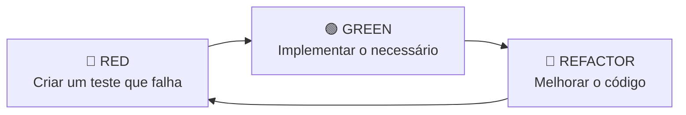
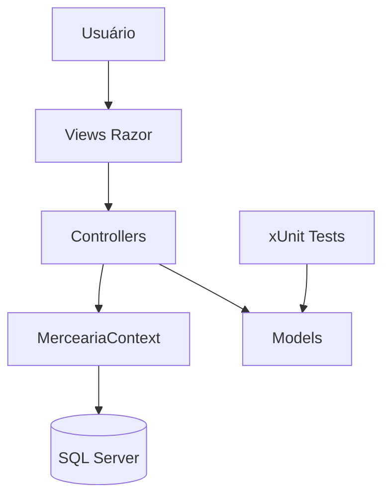
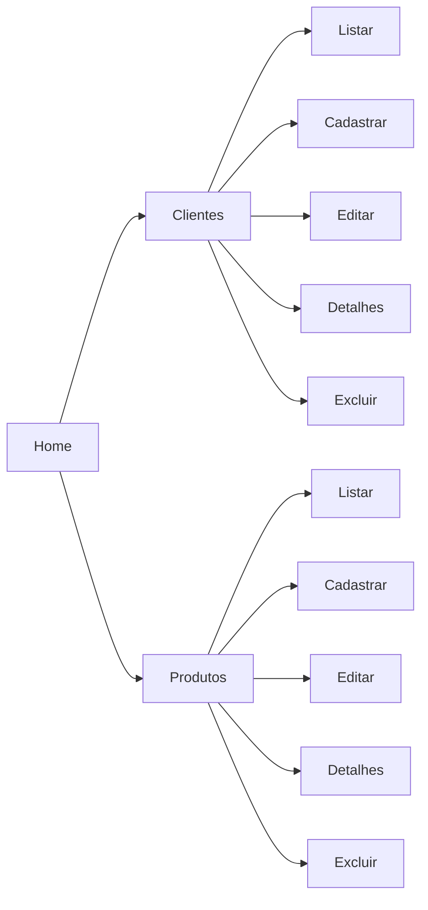

<div align="center">

# 🛒 MerceariaMVC

### Sistema de gerenciamento de clientes e produtos com ASP.NET Core MVC e TDD


**CRUD de clientes e produtos com persistência em SQL Server, interface MVC e testes unitários das regras de negócio.**

</div>

---

## 📌 Sobre o projeto

O **MerceariaMVC** é uma aplicação web desenvolvida em **ASP.NET Core MVC (.NET 8)** para praticar conceitos de desenvolvimento web, banco de dados e **TDD — Test-Driven Development**.

O sistema possui duas áreas principais:

- **Clientes** — cadastro, consulta, edição e exclusão de clientes;
- **Produtos** — cadastro, consulta, edição e exclusão de produtos e seus dados de estoque.

A página inicial funciona como ponto de acesso para os dois módulos, com atalhos para visualizar e cadastrar registros.

---

## ✨ Funcionalidades

### 👤 Clientes

- Listagem de clientes cadastrados;
- Cadastro de novos clientes;
- Edição de dados;
- Visualização de detalhes;
- Exclusão de registros;
- Controle de cliente ativo/inativo;
- Validação de idade, nome e e-mail;
- Regra para verificar se o cliente pode realizar compras.

### 📦 Produtos

- Listagem de produtos;
- Cadastro de novos produtos;
- Edição de nome, preço e estoque;
- Visualização de detalhes;
- Exclusão de registros;
- Validação de preço e quantidade em estoque.

### 🏠 Home

A Home possui atalhos para os dois módulos do sistema:

```text
Home
├── Clientes
│   ├── Ver clientes
│   └── Novo cliente
│
└── Produtos
    ├── Ver produtos
    └── Novo produto
```

---

## 🧪 TDD no projeto

O projeto possui um projeto de testes separado, chamado **MerceariaMVCTests**, utilizando **xUnit**.

O desenvolvimento orientado a testes segue o ciclo:



### 🔴 Red

Primeiro é criado um teste que representa o comportamento esperado.

### 🟢 Green

Em seguida é implementado o mínimo necessário para fazer o teste passar.

### 🔵 Refactor

Depois o código pode ser reorganizado e melhorado mantendo os testes como proteção contra regressões.

---

## ✅ Regras de negócio testadas

### 👤 Cliente

A classe `Cliente` possui os métodos:

```csharp
cliente.ValidacaoCliente();
cliente.PodeComprar();
```

Regras verificadas:

| Situação | Resultado esperado |
|---|---|
| Idade não informada | Cliente inválido |
| Idade menor que 18 anos | Cliente inválido |
| E-mail sem `@` | Cliente inválido |
| Nome vazio | Cliente inválido |
| Cliente inativo | Não pode comprar |
| Cliente ativo e maior de idade | Pode comprar |
| Dados válidos | Cliente válido |

### 📦 Produto

A classe `Produto` possui o método:

```csharp
produto.Validacao();
```

Regras verificadas:

| Situação | Resultado esperado |
|---|---|
| Preço igual ou menor que zero | Produto inválido |
| Estoque igual ou menor que zero | Produto inválido |
| Nome vazio | Produto inválido |
| Nome, preço e estoque válidos | Produto válido |

---

## 🧩 Padrão AAA nos testes

Os testes utilizam o padrão **Arrange → Act → Assert**.

```csharp
[Fact]
public void Verificar_Email_Invalido()
{
    // Arrange
    var cliente = new Cliente
    {
        Nome = "Carlos Augusto",
        Idade = 18,
        Email = "carlos#gmail.com",
        Ativo = true
    };

    // Act
    var resultado = cliente.ValidacaoCliente();

    // Assert
    Assert.False(resultado);
}
```

| Etapa | Responsabilidade |
|---|---|
| **Arrange** | Prepara os dados e objetos do teste |
| **Act** | Executa a funcionalidade testada |
| **Assert** | Confirma se o resultado é o esperado |

---

## 🏗️ Arquitetura

O projeto segue o padrão **MVC — Model, View, Controller**.



### Models

Representam os dados e concentram as regras de negócio utilizadas nos testes.

- `Cliente.cs`
- `Produto.cs`

### Views

Responsáveis pela interface do sistema, utilizando **Razor + Bootstrap**.

Cada módulo possui páginas para:

- `Index`
- `Create`
- `Edit`
- `Details`
- `Delete`

### Controllers

Recebem as requisições, acessam o banco pelo Entity Framework Core e retornam as Views.

- `HomeController`
- `ClienteController`
- `ProdutoController`

### Data

O `MerceariaContext` é o `DbContext` da aplicação e disponibiliza:

```csharp
public DbSet<Cliente> Clientes { get; set; }
public DbSet<Produto> Produtos { get; set; }
```

---

## 🗄️ Banco de dados

A persistência é feita utilizando:

- **Entity Framework Core 8**;
- **SQL Server**;
- **Migrations**.

A conexão é configurada no `Program.cs` por meio de `DefaultConnection`:

```csharp
builder.Services.AddDbContext<MerceariaContext>(x =>
    x.UseSqlServer(builder.Configuration.GetConnectionString("DefaultConnection")));
```

> Configure a `DefaultConnection` no `appsettings.json` ou `appsettings.Development.json` de acordo com a sua instância do SQL Server.

### Aplicar as migrations

```bash
dotnet ef database update --project MerceariaMVC/MerceariaMVC.csproj
```

Caso a ferramenta `dotnet-ef` ainda não esteja instalada:

```bash
dotnet tool install --global dotnet-ef
```

---

## 📂 Estrutura do projeto

```text
MerceariaMVC/
│
├── MerceariaMVC/
│   ├── Controllers/
│   │   ├── ClienteController.cs
│   │   ├── HomeController.cs
│   │   └── ProdutoController.cs
│   │
│   ├── Data/
│   │   └── MerceariaContext.cs
│   │
│   ├── Migrations/
│   │
│   ├── Models/
│   │   ├── Cliente.cs
│   │   ├── Produto.cs
│   │   └── ErrorViewModel.cs
│   │
│   ├── Views/
│   │   ├── Cliente/
│   │   ├── Home/
│   │   ├── Produto/
│   │   └── Shared/
│   │
│   ├── wwwroot/
│   ├── Program.cs
│   ├── appsettings.json
│   └── MerceariaMVC.csproj
│
├── MerceariaMVCTests/
│   ├── ClienteTests.cs
│   ├── ProdutoTests.cs
│   └── MerceariaMVCTests.csproj
│
├── MerceariaMVC.sln
├── .gitignore
└── README.md
```

---

## 🛠️ Tecnologias utilizadas

| Tecnologia | Uso |
|---|---|
| **C#** | Linguagem principal |
| **.NET 8** | Plataforma da aplicação |
| **ASP.NET Core MVC** | Estrutura web |
| **Razor** | Construção das páginas |
| **Bootstrap** | Estilização da interface |
| **Entity Framework Core** | Acesso e persistência de dados |
| **SQL Server** | Banco de dados |
| **Migrations** | Versionamento da estrutura do banco |
| **xUnit** | Testes unitários |
| **Coverlet** | Coleta de cobertura dos testes |

---

## 🚀 Como executar

### Pré-requisitos

- [.NET SDK 8](https://dotnet.microsoft.com/download/dotnet/8.0)
- SQL Server
- Visual Studio 2022, Rider ou VS Code

### 1. Clone o repositório

```bash
git clone https://github.com/Samuel-Ramos-Rodrigues/MerceariaMVC.git
cd MerceariaMVC
```

### 2. Restaure os pacotes

```bash
dotnet restore MerceariaMVC.sln
```

### 3. Configure o banco

Defina a `DefaultConnection` no arquivo de configuração apropriado para o seu ambiente.

### 4. Atualize o banco de dados

```bash
dotnet ef database update --project MerceariaMVC/MerceariaMVC.csproj
```

### 5. Compile a solução

```bash
dotnet build MerceariaMVC.sln
```

### 6. Execute a aplicação

```bash
dotnet run --project MerceariaMVC/MerceariaMVC.csproj
```

Depois, abra no navegador o endereço exibido pelo terminal.

---

## 🧪 Executando os testes

Para executar todos os testes:

```bash
dotnet test MerceariaMVC.sln
```

Ou somente o projeto de testes:

```bash
dotnet test MerceariaMVCTests/MerceariaMVCTests.csproj
```

### Cobertura de testes

```bash
dotnet test MerceariaMVC.sln --collect:"XPlat Code Coverage"
```

Os resultados serão gerados em `TestResults`.

---

## 🎨 Interface

A interface foi mantida simples e objetiva, utilizando os componentes já disponíveis no **Bootstrap**.

A estilização atual inclui:

- Home com atalhos para Clientes e Produtos;
- Cards simples para os módulos principais;
- Tabelas organizadas nas listagens;
- Formulários de cadastro e edição mais claros;
- Páginas de detalhes e exclusão padronizadas;
- Botões diferenciados para ações como editar, visualizar e excluir;
- Layout responsivo.

---

## 🔄 Fluxo geral do sistema



---

## 💡 Possíveis evoluções

- Adicionar relacionamento entre clientes, compras e produtos;
- Criar módulo de vendas;
- Registrar histórico de compras;
- Implementar controle de entrada e saída do estoque;
- Criar testes para Controllers;
- Utilizar `[Theory]` e `[InlineData]` nos testes;
- Criar camada de serviços para regras de negócio;
- Adicionar autenticação e controle de acesso;
- Aumentar a cobertura de testes.

---

## 📚 Conceitos praticados

`TDD` · `xUnit` · `Testes Unitários` · `AAA` · `ASP.NET Core MVC` · `Entity Framework Core` · `SQL Server` · `CRUD` · `Razor` · `Bootstrap` · `C#` · `.NET 8`

---

<div align="center">

### 🛒 MerceariaMVC

**Projeto desenvolvido para estudo de ASP.NET Core MVC, CRUD, Entity Framework Core e desenvolvimento orientado a testes.**

</div>
